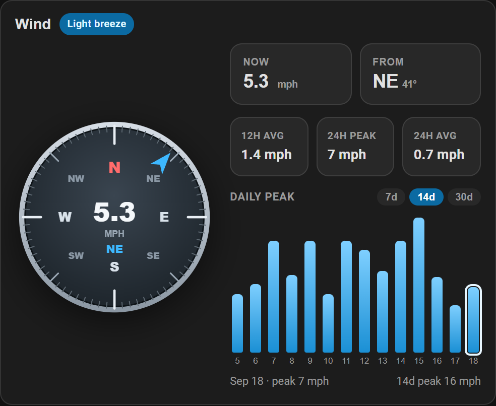
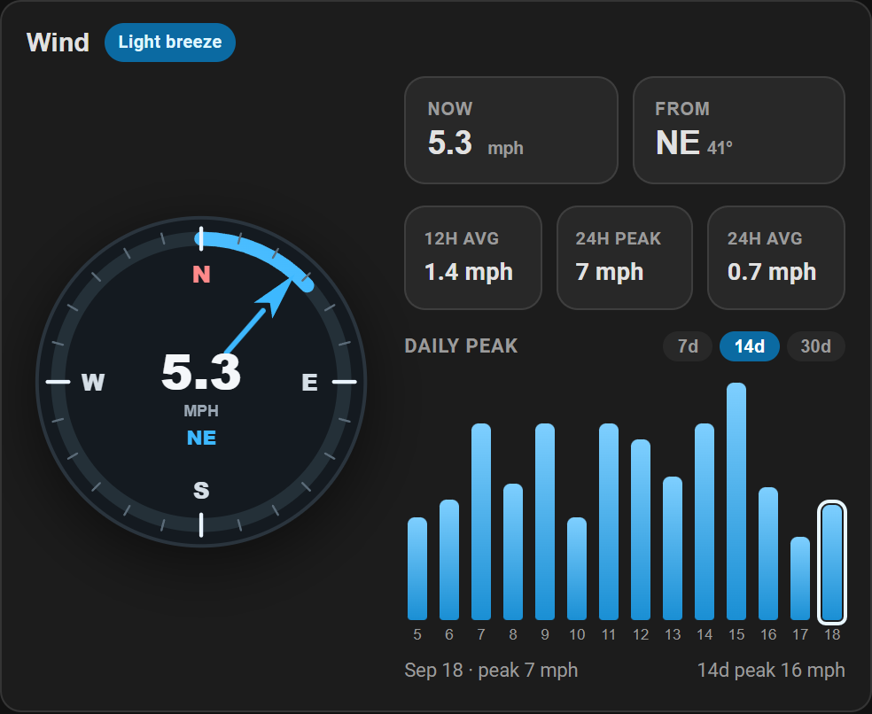
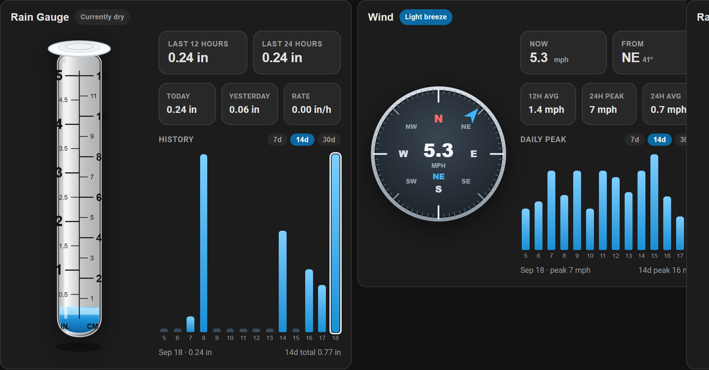

# Wind Plus Card

[](https://github.com/hacs/integration)
[](https://my.home-assistant.io/redirect/hacs_repository/?owner=randrcomputers&repository=ha-wind-card&category=plugin)
[](LICENSE)

Lovelace card with a **compass rose** (or modern dial), current **speed** and **direction**, 12h / 24h stats, and a daily peak history chart.

Works with a wind-speed sensor plus an optional heading / direction sensor. History comes from the Home Assistant recorder (hourly mean / max, daily max).


The needle points to the direction the wind is **coming from** (meteorological heading). **N** is up.

## Looks

Pick a style in the visual editor (**Compass look**) or with `look:` in YAML. These are live shots of the card in Home Assistant.

| Compass rose | Modern dial |
| :---: | :---: |
|  |  |
| `rose` | `modern` |

| `look` | Editor label | Notes |
| --- | --- | --- |
| `rose` | Compass rose | Classic N/E/S/W rose, speed in the center |
| `modern` | Modern dial | Clean compass plus a speed arc around the rim |

Modern uses **Dial full scale** (`max_speed`) for that outer arc (default **40** mph, or the matching value in your display units).



## Install

### HACS (recommended)

If HACS is already on your Home Assistant, click this button to open the repository and download it:

[](https://my.home-assistant.io/redirect/hacs_repository/?owner=randrcomputers&repository=ha-wind-card&category=plugin)

Then **Download**, reload dashboard resources, and hard-refresh the browser (**Ctrl+F5**).

Or add it by hand: **HACS → Frontend → ⋮ → Custom repositories** →

```
https://github.com/randrcomputers/ha-wind-card
```

Category: **Lovelace** / **Dashboard**

### Manual

1. Copy `wind-plus-card.js` to `config/www/`
2. [](https://my.home-assistant.io/redirect/lovelace_resources/) → add `/local/wind-plus-card.js` as a **JavaScript module**
3. Hard-refresh the browser (**Ctrl+F5**)

## Quick start

```yaml
type: custom:wind-plus-card
name: Wind
look: rose
entity: sensor.outside_wind_and_rain_wind_speed
direction_entity: sensor.outside_wind_and_rain_wind_heading_2
```

Any `wind_speed` sensor works. Direction can be degrees (`315`) or a cardinal (`NW`, `ESE`, …).

Set **Card size** to **50%** in the editor, or `size: 50` in YAML, to shrink the whole card.

## What you see

| Area | Source |
| --- | --- |
| Compass needle | Wind direction / heading (degrees or N/NE/E/…) |
| Center speed | Wind speed entity |
| **Light breeze** (Beaufort badge) | Derived from current speed |
| Now | Live wind speed |
| From | Cardinal + degrees |
| 12h avg | Mean of hourly recorder statistics |
| 24h peak | Max of hourly recorder statistics |
| 24h avg / Gust | 24h mean, or a gust sensor when configured |
| History | Daily **peak** speed for 7 / 14 / 30 days |

History bars are **calendar days, midnight to midnight** in Home Assistant’s timezone. **12h avg** and **24h peak** are rolling windows from now.

## Options

All of these are in the visual editor. YAML names match the editor labels below.

| YAML | Editor | Required | Default | Description |
| --- | --- | --- | --- | --- |
| `look` | Compass look | no | `rose` | `rose` or `modern` — see **Looks** |
| `size` | Card size | no | `100` | Overall card scale: `100`, `75`, or `50` |
| `entity` | Wind speed | **yes** | — | `sensor` with device class **wind speed** |
| `direction_entity` | Wind direction / heading | no | — | Degrees or cardinal (`NW`, `ESE`, …) |
| `gust_entity` | Wind gust (optional) | no | — | Gust speed sensor |
| `name` | Card title | no | `Wind` | Header text |
| `max_speed` | Dial full scale (modern look) | no | `40` | Full-scale for the modern speed arc |
| `unit_system` | Display units | no | `auto` | `auto`, `imperial` (mph), `metric` (km/h), `ms` (m/s), `knots` |
| `history_days` | Default history range | no | `14` | `7`, `14`, or `30` |
| `show_history` | Show daily peak history | no | `true` | Daily bar chart |
| `show_gust` | Show gust | no | `true` | Gust tile when `gust_entity` is set |

### Example with every option

```yaml
type: custom:wind-plus-card
name: Wind
look: rose
size: 100
entity: sensor.outside_wind_and_rain_wind_speed
direction_entity: sensor.outside_wind_and_rain_wind_heading_2
gust_entity: sensor.outside_wind_and_rain_wind_gust
max_speed: 40
unit_system: imperial
history_days: 14
show_history: true
show_gust: true
```

Leave `gust_entity` off if you do not have a gust sensor — the third stat tile stays **24h avg**.

`max_speed` only changes the modern dial’s outer arc. The rose look ignores it.

## Requirements

- Home Assistant **2024.1+**
- Recorder enabled (for 12h / 24h and history)
- A wind speed sensor. Direction / heading is optional but recommended.

## License

MIT — see [LICENSE](LICENSE).
